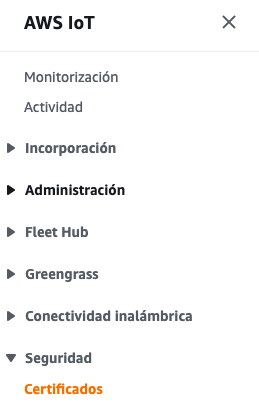
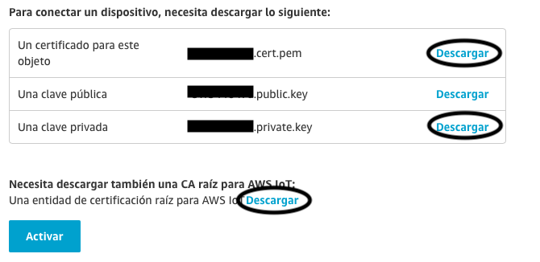
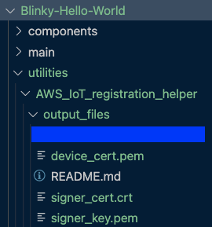
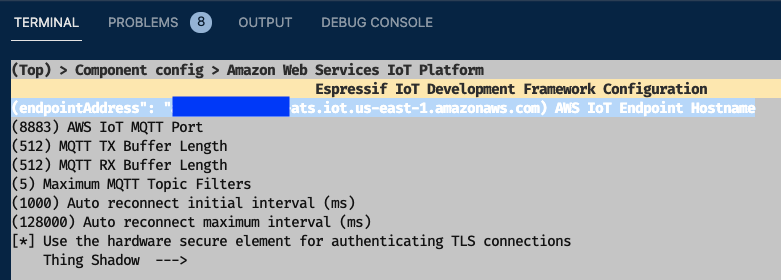

# IoT con AWS EduKit 101
Fuente: https://edukit.workshop.aws/en/

En este tutorial se conectara el AWS EduKit a la nube de AWS IoT e intercambiaran mensajes MQTT. 

## ¿Que es un EduKit?: 

AWS IoT EduKit es una forma sencilla de aprender a crear aplicaciones de IoT utilizando los servicios de AWS. Entregando una experiencia práctica en la creación de aplicaciones de IoT de punto a punto mediante la combinación de un kit de hardware un conjunto de guías fáciles de seguir y códigos de ejemplos.


### Características: 

- Hardware Simple:

ESP32-D0WDQ6-V3

WiFi de 2.4 GHz

Bluetooth 4.2

flash de 16 M

Microchip ATECC608 Trust&GO

Pantalla táctil

- Multi-Software Supports
FreeRTOS

MicroPython

UIFlow

ArDuino


- Ejemplos de Códigos a la mano

AWS proporciona multiples tutoriales para que puedas desarrollar tus habilidades.

## ¡¡Metamos las manos!!

### ¿Que necesitas?

- [x] Una cuenta AWS. [Crea tu cuenta con capa gratuita](https://aws.amazon.com/es/free/?all-free-tier.sort-by=item.additionalFields.SortRank&all-free-tier.sort-order=asc)
- [x] Un EduKit. Puedes obtener uno https://shop.m5stack.com/products/m5stack-core2-esp32-iot-development-kit-for-aws-iot-edukit o https://www.amazon.com/dp/B08VGRZYJR/
- [x] Configurada tus credenciales de acceso de la cuenta AWS. [Aca como lo puedes hacer](https://docs.aws.amazon.com/es_es/cli/latest/userguide/install-cliv2.html)
- [x] [Visual Studio Code (VS Code)](https://code.visualstudio.com/) 
- [x] CLI [instalado](https://docs.aws.amazon.com/es_es/cli/latest/userguide/cli-chap-install.html) y [configurado](https://docs.aws.amazon.com/es_es/cli/latest/userguide/cli-configure-sso.html)  


### Parte 1: Crear un certificado en AWS IoT Core.

***¿Que es AWS IoT Core?***

AWS IoT Core es un servicio en la nube administrado que permite a los dispositivos conectados interactuar de manera fácil y segura con las aplicaciones en la nube y otros dispositivos.


[Conoce más sobre AWS IoT Core](https://aws.amazon.com/es/iot-core/?nc=sn&loc=2&dn=3)

***Iniciemos***

Vamos al servicio [AWS IoT Core](https://console.aws.amazon.com/iot/home?region=us-east-1#:~:text=alertas%20de%20respuesta-,IoT%20Core,-Conecte%20dispositivos%20a) 

1. Ir al menu Seguridad 
2. Certificados
2. Crear



En el siguiente paso debes darle Click a **"Crear Certificado"**

El certificado es único por objeto y es la forma segura de interactuar con los servicios de AWS IoT desde los dispositivos, esta debe ser grabada como una clave privada en la memoria de los dispositivos al momento de su programación para que nunca se transfiera a través de Internet junto con las solicitudes, lo que significa una gran ventaja de seguridad.


 

 Descargue el certificado y la clave privada para el dispositivo, y también el rootCA 1 . 


- Duplica el archivo de certificado con el siguiente nombre **certificate.pem**
- Duplica el archivo de privateKey con el siguiente nombre **privateKey.pem**
- Duplica el archivo de rootCA 1 con el siguiente nombre **rootCA.pem**

 Asegurate de presionar el botón de **"Activar"** para que se pueda usar el certificado. 


Finaliza el proceso haciendo clic en el botón **"Listo"**. 

El siguiente punto es crear y adjuntar una política al certificado, que autorice al dispositivo autenticado a realizar acciones de IoT en los recursos de AWS IoT.

Para crear la política debes ir al menú del lado izquierdo **Seguridad -> Políticas** una vez ahí debes darle Click a **"Crear una Política"**, para efectos de este ejercicio la nombráremos **objeto1-policity**, completa los campos (Acción, ARN de recurso) con un asterisco **"*"**, esto solo para efectos de este ejercicio, debido a que permite todo, marque la opción Permitir efecto y luego presione el botón **"Crear"**. 

**Nota:** Para un desarrollo en producción real, utilice la definición de política que brinde el mínimo permiso necesario para el funcionamiento del dispositivo (más información: [https://docs.aws.amazon.com/IAM/latest/UserGuide/best-practices.html#grant-least-privilege](https://docs.aws.amazon.com/IAM/latest/UserGuide/best-practices.html#grant-least-privilege))

Ahora en el menú del lado izquierdo **Seguridad > Certificados**, verás el certificado que se creó anteriormente, toque los tres puntos de la derecha y elija **Asociar política**, aparecerá una ventana emergente que muestra sus políticas existentes, selecciona la política creada recientemente y asocia, finaliza el proceso con **”Activar”**. 

**¡¡Esto es todo Felicidades!! ya has creado tu primer objeto de AWS IoT con éxito, le has generado un certificado y le has adjuntado una política.**

---

### Parte 2: Conocer el puerto del EduKit.

Para interactuar con nuestro EduKit necesitamos adecuar el ambiente, para lo cual debes instalar el bridge y su traductor.

Sigue el siguiente manual dependiendo del sistema operativo que utilices. 

[Ubuntu Linux v18.0+ (64-bit)](https://edukit.workshop.aws/en/getting-started/prerequisites/linux.html)

[MacOS 10.14+](https://edukit.workshop.aws/en/getting-started/prerequisites/macos.html)

[Windows 10 (64-bit)](https://edukit.workshop.aws/en/getting-started/prerequisites/windows.html)

Copia el puerto del dispositivo ya que lo necesitaras en el próximo paso.

---

### Parte 3: Activar el EduKit.

### Parte 3: Obterner el certificado del EduKit.

Para crear una conexión segura TLS entre el AWS EduKit y AWS IoT Core a través de MQTT, debe crear un Objeto en AWS IoT Core con las credenciales (clave única) del AWs IoT EduKit. 

Para extraer las credenciales del AWS EduKit debemos seguir los siguientes pasos: 

1. En Visual Studio Code, ir a la extensión PlatformIO.
2. Ir al menu Open. 
3. Y abrir el proyecto en la ubicación ***Core2-for-AWS-IoT-EduKit/Blinky-Hello-World***


4. El proyecto tiene incorporado un script en python que te permite extraer las credenciales del AWS EduKit, para correrlo debes correr los siguientes comandos en el terminal del proyecto: 

***Ubuntu o macOS***

```python
cd utilities/AWS_IoT_registration_helper
python3 registration_helper.py -p <<DEVICE_PORT>>
```

***Windows***

```python
cd utilities\AWS_IoT_registration_helper\
python registration_helper.py -p <<DEVICE_PORT>>
```
5. Una vez finalizado el script debes buscar los certificados en la carpeta output_files. 



### Parte 4: Conectemos el AWS EduKit con AWS IoT Core: 

En este capítulo, configurará, creará y actualizará el firmware de su dispositivo, lo que permitirá que su dispositivo se conecte a su red Wi-Fi y a AWS IoT Core. 
Para conectarse y comunicarse con AWS IoT Core, debe configurar la red wifi a su dispositivo y el endpoint de AWS IoT. 

1. Obten el endpoint de aws iot de tu cuenta con el comando:

```python
aws iot describe-endpoint --endpoint-type iot:Data-ATS
```
Para cerrar presiona ***:q***

Debe ser algo como: 

"xxxxxxxxxxxx-ats.iot.us-east-1.amazonaws.com"

"endpointAddress": "a1w8sdhvrtune7-ats.iot.us-east-1.amazonaws.com"

2. Configuración del firmware ESP32 en el AWS EduKit
La configuración de su código fuente se maneja a través de Kconfig. Kconfig es el mismo sistema de configuración utilizado por el kernel de Linux y ayuda a simplificar las opciones de configuración disponibles (símbolos) en una estructura de árbol. 

Para hacerlo debes ingresar a PlataformIO, dandole click al logo y abriendo una nueva terminal. 


Y tienes que asegurarte que la terminal este en PlataformIO CLI, de lo contrario no se estara comunicando con nuestro AWS EduKit. 


Corre los siguientes comandos: 

```python
cd Core2-for-AWS-IoT-EduKit/Blinky-Hello-World/    
pio run --environment core2foraws --target menuconfig
```

***En caso de error***: 

En el caso de ocurrir el error: 

```python
  File "/Users/elizabethfuentesleone/.platformio/packages/framework-espidf/tools/kconfig_new/menuconfig.py", line 716, in menuconfig
    locale.setlocale(locale.LC_ALL, "")
  File "/Users/elizabethfuentesleone/.platformio/python3/lib/python3.9/locale.py", line 610, in setlocale
    return _setlocale(category, locale)
locale.Error: unsupported locale setting
```

Debes abrir el archivo: 


y modificar ***""*** por ***None***


Y correr nuevamente. 

3. Establecer la configuracion interna del ESP32 del AWS EduKIt

Una vez finalizado el paso anterior serás capaz de ver la interfaz  Kconfig. En el menú ingresa a ***Component config > Amazon Web Services IoT Plataform*** e ingresa el string del ednpoint obtenido en el ***Paso 1*** y presiona enter.



Presiona ESC dos veces, ahora ingresa al menu ***AWS IoT EduKit Configuration*** y configura tu WiFi SSID/WiFi PassWord, para editar debes presionar enter. 

***Nota:*** La red WiFi debe ser 2.4GHz, el ESP32 no soporta 5GHz


Salva la configuración presionando la tecla ***s***, confirma el destino con enter y luego presiona la tecla ***q*** para salir. 

4. Construyendo, cargando y monitoreando el firmware Blinky Hello World

Ahora está listo para construir (compilar) y cargar el firmware Blinky Hello World. El proceso es el mismo que con el tutorial de introducción para construir, flashear y monitorear la salida serial:

- Para construir el firmware, corre el siguiente comando (tomará algunos minutos):

```python
pio run --environment core2foraws
```
