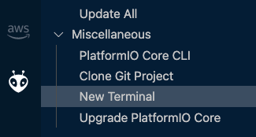

# IoT con AWS EduKit 101

En este tutorial se enseñaremos a realizar la comunicación MQTT entre un dispositivo AWS EduKit y AWS IoT Core, abriendo la posibilidad de crear multiples desarrollos juntando las funcionalidades IoT de EduKit con la nube de AWS. 

Esta basado en CLOUD CONNECTED BLINKY del workshop de AWS Edukit https://edukit.workshop.aws/en/

---

## AWS IoT Core 


AWS IoT Core es un servicio en la nube administrado que permite a los dispositivos conectados interactuar de manera fácil y segura con las aplicaciones en la nube y otros dispositivos.

Los mensajes son transmitidos y recibidos utilizando el protocolo MQTT ([Message Queueing Telemetry Transport](https://mqtt.org/)) que reduce el uso del ancho de banda.


[Conoce más sobre AWS IoT Core](https://aws.amazon.com/es/iot-core/?nc=sn&loc=2&dn=3)

---

## AWS EduKit

AWS IoT EduKit es una forma sencilla de aprender a crear aplicaciones de IoT utilizando los servicios de AWS. Entregando una experiencia práctica en la creación de aplicaciones de IoT de punto a punto mediante la combinación de un kit de hardware un conjunto de guías fáciles de seguir y códigos de ejemplos.


### Características: 

- Hardware Simple:

ESP32-D0WDQ6-V3

WiFi de 2.4 GHz

Bluetooth 4.2

flash de 16 M

[Microchip ATECC608 Trust&GO](https://aws.amazon.com/es/blogs/apn/implementing-secure-authentication-with-aws-iot-and-microchips-trust-platform/)

Pantalla táctil

- Multi-Software Supports
FreeRTOS

MicroPython

UIFlow

ArDuino


- Ejemplos de Códigos a la mano

AWS proporciona multiples tutoriales para que puedas desarrollar tus habilidades.

## ¡¡Metamos las manos!!

### ¿Que necesitas?

- [x] Una cuenta AWS. [Crea tu cuenta con capa gratuita](https://aws.amazon.com/es/free/?all-free-tier.sort-by=item.additionalFields.SortRank&all-free-tier.sort-order=asc)
- [x] Un EduKit. Puedes obtener uno https://shop.m5stack.com/products/m5stack-core2-esp32-iot-development-kit-for-aws-iot-edukit o https://www.amazon.com/dp/B08VGRZYJR/
- [x] Configurada tus credenciales de acceso de la cuenta AWS. [Aca como lo puedes hacer](https://docs.aws.amazon.com/es_es/cli/latest/userguide/install-cliv2.html)
- [x] [Visual Studio Code (VS Code)](https://code.visualstudio.com/) 
- [x] CLI [instalado](https://docs.aws.amazon.com/es_es/cli/latest/userguide/cli-chap-install.html) y [configurado](https://docs.aws.amazon.com/es_es/cli/latest/userguide/cli-configure-sso.html)  


---
### Parte 1 Instalar el ambiente para interactuar con AWS EduKit.


Para interactuar con nuestro EduKit necesitamos adecuar el ambiente, para lo cual debes instalar el bridge y la extensión de desarrollo.

Sigue el siguiente manual dependiendo del sistema operativo que utilices. 

[Ubuntu Linux v18.0+ (64-bit)](https://edukit.workshop.aws/en/getting-started/prerequisites/linux.html)

[MacOS 10.14+](https://edukit.workshop.aws/en/getting-started/prerequisites/macos.html)

[Windows 10 (64-bit)](https://edukit.workshop.aws/en/getting-started/prerequisites/windows.html)

Copia el puerto del dispositivo ya que lo necesitaras en el próximo paso.

---

### Parte 2: Extrae el certificado del AWS EduKit y registralo en AWS IoT Core.

Para crear una conexión segura TLS entre el AWS EduKit y AWS IoT Core a través de MQTT, debe crear un Objeto en AWS IoT Core con el certificado (clave única) del AWs IoT EduKit, el repositorio que clonamos nos proporciona un programa en python que extrae el certificado del AWS EduKit y crea un objeto en AWS IoT Core al cual le asocia el certificado con las politicas necesarias para establecer la comunicación. 

Para extraer las credenciales del AWS EduKit y registrarlo en AWS IoT Core debemos seguir los siguientes pasos: 

1. En Visual Studio Code, ir a la extensión PlatformIO dandole click al logo.

2. Ir al menu Open. 

3. Abrir el proyecto en la ubicación ***Core2-for-AWS-IoT-EduKit/Blinky-Hello-World***


4. Abrir una nueva terminal desde PlatformIO. 



5. Revisa los disposivos creados en AWS IoT, para poder comparar al final:

```python
aws iot list-things
```
o en la [consola](https://console.aws.amazon.com/iot/home?region=us-east-1#/)

6. Asegurando que estes en PlatformIO CLI y en la carpeta ***Core2-for-AWS-IoT-EduKit/Blinky-Hello-World/*** corre los siguientes comandos con el DEVICE que copiaste en el ***Paso 1***: 


***Ubuntu o macOS***

```python
cd utilities/AWS_IoT_registration_helper
python3 registration_helper.py -p <<DEVICE_PORT>>
```

***Windows***

```python
cd utilities\AWS_IoT_registration_helper\
python registration_helper.py -p <<DEVICE_PORT>>
```
5. Verifica que se creo el nuevo objeto en AWS IoT Core. 

```python
aws iot list-things
```

[Consola](https://console.aws.amazon.com/iot/home?region=us-east-1#/)

---

### Parte 3: Conectemos el AWS EduKit con AWS IoT Core

En este capítulo, configurará, creará y actualizará el firmware de su dispositivo, lo que permitirá que se conecte a la red Wi-Fi y al AWS IoT Core mediante el endpoint. 


1. Obten el endpoint de aws iot de tu cuenta con el comando:

```python
aws iot describe-endpoint --endpoint-type iot:Data-ATS
```
Para cerrar presiona ***:q***

Debe ser algo como: 

"xxxxxxxxxxxx-ats.iot.us-east-1.amazonaws.com"

2. Configuración del firmware ESP32 en el AWS EduKit

La configuración de su código fuente se maneja a través de Kconfig. Kconfig es el mismo sistema de configuración utilizado por el kernel de Linux y ayuda a simplificar las opciones de configuración disponibles (símbolos) en una estructura de árbol. 

Para hacerlo debes ingresar a PlataformIO, dandole click al logo y abriendo una nueva terminal. 


Asegurate que la terminal este en PlataformIO CLI, de lo contrario no se estara comunicando con nuestro AWS EduKit. 


Corre los siguientes comandos: 

```python
cd Core2-for-AWS-IoT-EduKit/Blinky-Hello-World/    
pio run --environment core2foraws --target menuconfig
```

***En caso de error***: 

En el caso de ocurrir el error: 

```python
  File "/Users/elizabethfuentesleone/.platformio/packages/framework-espidf/tools/kconfig_new/menuconfig.py", line 716, in menuconfig
    locale.setlocale(locale.LC_ALL, "")
  File "/Users/elizabethfuentesleone/.platformio/python3/lib/python3.9/locale.py", line 610, in setlocale
    return _setlocale(category, locale)
locale.Error: unsupported locale setting
```

Debes abrir el archivo: 


y modificar ***""*** por ***None***


Y correr nuevamente. 

3. Establecer la configuracion interna del ESP32 del AWS EduKIt

Una vez finalizado el paso anterior serás capaz de ver la interfaz  Kconfig. En el menú ingresa a ***Component config > Amazon Web Services IoT Plataform*** e ingresa el string del ednpoint obtenido en el ***Paso 1*** y presiona enter.

Presiona ESC dos veces, ahora ingresa al menu ***AWS IoT EduKit Configuration*** y configura tu WiFi SSID/WiFi PassWord, para editar debes presionar enter. 

***Nota:*** La red WiFi debe ser 2.4GHz, el ESP32 no soporta 5GHz


Salva la configuración presionando la tecla ***s***, confirma el destino con enter y luego presiona la tecla ***q*** para salir. 

---


## Parte 4: Construyendo, cargando y monitoreando el firmware Blinky Hello World

Ahora está listo para construir (compilar) y cargar el firmware Blinky Hello World. El proceso es el mismo que con el tutorial de introducción para construir, flashear y monitorear la salida serial:

- Para construir el firmware, corre el siguiente comando (tomará algunos minutos):

```python
pio run --environment core2foraws
```
- Con la compilación exitosa, es hora de cargar el firmware compilado al dispositivo conectado a través de USB ejecutando el comando:

```python
pio run --environment core2foraws --target upload
```

- Por último, supervise la salida en serie del dispositivo en su máquina host a través del siguiente comando:

```python
pio run --environment core2foraws --target monitor
```

Donde pide el puerto coloca el copiado en el Paso 1, en mi caso es Mac y deberias ver lo siguiente: 


---

### Parte 5: Monitoriar desde AWS IoT Core: 

La consola de AWS IoT Core le permite ver y publicar mensajes MQTT. 

Para comenzar, ve a la consola de AWS IoT y elija Prueba --> Cliente de prueba de MQTT.


En el campo de prueba ingresa el ID del dispositivo de esta forma ***0123331be471ac3f01/#***:


En el campo subscribirse al tema:


Presiona Subscribir y si el dispositivo esta transmitiendo seras capaz de ver los mensajes. 

***¡¡Felicidades!! ya tienes tu EduKit conectado a la nube de AWS!!!***

---

## Si quiere realizar más actividades con EduKit te invito a completar el WorkShop de AWS --> https://edukit.workshop.aws/en/
---
